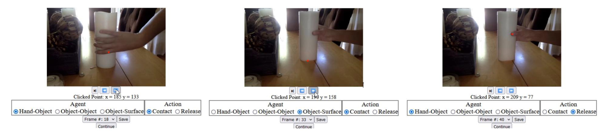

# ssv2-contact-release-interaction-dataset

A **metadata and annotation repository** for video interaction recognition,  
structured according to the **Something-Something V2** dataset format.

---

## Dataset Label Structure

This repository follows the **Something-Something V2** interaction schema,  
where each video in the original dataset is associated with a **template** and **placeholders**  
representing the objects involved in the interaction.

> Note: This repository contains only metadata and annotations — not the original videos.

---

## Metadata Folder

All dataset-related metadata files are stored under the `metadata/` directory.  
These files contain structured information about labeled video events, dataset splits,  
and mappings between templates and video IDs.

---

### 1. `metadata/video_events_labels.json`

Contains detailed labels for each annotated event, including the type of interaction and its frame-level attributes.  
Each key represents a video ID, and the value is a list of labeled events.

**Format example:**
```json
{
  "20": [
    {
      "action": "release",
      "agent": "hand-object",
      "frameNumber": 9,
      "pointX": 113,
      "pointY": 169
    }
  ]
}
```

**Description:**
- `action` – Type of event (e.g., `contact`, `release`)  
- `agent` – Interacting entities (e.g., `hand-object`, `object-surface`)  
- `frameNumber` – The frame in which the event occurs  
- `pointX`, `pointY` – Pixel coordinates of the annotated event in the frame  

---

### 2. `metadata/template_to_video_ids_map.json`

Maps each action template to all video IDs that were manually labeled and contain interaction events (contact/release).  
Only videos with valid annotations are included.

**Format example:**
```json
{
  "Putting something on a surface": ["5845", "8627", "19469"],
  "Lifting something": ["7001", "7154", "7320"]
}
```

---

### 3. `metadata/train_videos_ids_labeled.json`,  
`metadata/validation_videos_ids_labeled.json`,  
`metadata/test_videos_ids_labeled.json`

These three files list the video IDs from the corresponding dataset split (train/validation/test)  
that were selected for labeling and contain at least one interaction event.

**Format example:**
```json
[
  "5845",
  "8627",
  "19469",
  "20251"
]
```

---

## Frame Extraction

We extracted frames from all videos using **OpenCV 4.7.0** at their original FPS.  
Each frame was saved as a `.jpg` image (default quality = 95) in **BGR color format** —  
the default channel order used internally by OpenCV.

**Example:**
```python
import os
import cv2


def video_to_frames(video_path, output_dir):
    os.makedirs(output_dir, exist_ok=True)  # ensure output folder exists

    cap = cv2.VideoCapture(video_path)
    fps = cap.get(cv2.CAP_PROP_FPS)
    count = 0

    while cap.isOpened():
        ret, frame = cap.read()

        if not ret:
            break

        cv2.imwrite(os.path.join(output_dir, f"frame_{count:05d}.jpg"), frame)
        count += 1

    cap.release()
    print(f"Extracted {count} frames at {fps:.2f} FPS.")
```

The same procedure was applied to all videos in the dataset on a computing cluster,
using individual jobs per video.

---

## Annotating Frames



Collecting human annotations for interactions using the Amazon Mechanical Turk platform.  
Human subjects were asked to annotate **core interaction events** in videos from the SSv2 dataset [2].  

Shown here are example annotations for **“contact”** and **“release”** events, where the target object (white candle)  
becomes attached to a hand (left) and a surface (middle), or detached from the hand (right).  

Each annotation includes:
- The **event type** (e.g., contact, release)  
- The **agent–object pair** (hand–object, object–surface, etc.)  
- The **spatiotemporal location** of the event (frame number and image coordinates)

---

**Example code snippet:**
```python
from io import BytesIO
from urllib.request import urlopen
from PIL import Image, ImageDraw
import numpy as np
from pathlib import Path


def annotate_frame(lbl, wrkr_id_save_dir, point_x, point_y, frame_number, agent, action, point_radius=5):
    """
    Draws annotation info (point, frame number, agent, and action) on an image
    and saves it locally.

    Args:
        lbl (dict): Label data containing 'imageURL'.
        wrkr_id_save_dir (Path or str): Directory where the annotated image will be saved.
        point_x (int): X coordinate of the clicked point.
        point_y (int): Y coordinate of the clicked point.
        frame_number (int): Frame number within the video.
        agent (str): Agent type (e.g., 'Hand-Object', 'Object-Surface').
        action (str): Action type (e.g., 'Contact', 'Release').
        point_radius (int, optional): Radius of the point marker. Defaults to 5.

    Returns:
        Path: Path to the saved annotated image.
    """

    # Ensure save directory exists
    save_dir = Path(wrkr_id_save_dir)
    save_dir.mkdir(parents=True, exist_ok=True)

    # Load the image from the provided URL
    img_url = lbl.get('imageURL')
    url = urlopen(img_url)
    img = Image.open(BytesIO(url.read()))

    # Draw the annotations on the image
    draw = ImageDraw.Draw(img)

    # Draw the red point
    draw.ellipse(
        (point_x - point_radius, point_y - point_radius,
         point_x + point_radius, point_y + point_radius),
        fill=(255, 0, 0)
    )

    # Pick a contrasting color for the text (based on mean image color)
    mean_color = (*(255 - np.asarray(img)[:150, :150].mean(axis=(0, 1))).astype(int), 0)

    # Add textual information
    draw.text((10, 10), f'Frame: {frame_number}', fill=mean_color)
    draw.text((10, 25), f'Point: ({point_x}, {point_y})', fill=mean_color)
    draw.text((10, 40), f'Agent: {agent}', fill=mean_color)
    draw.text((10, 55), f'Action: {action}', fill=mean_color)

    # Save the annotated image
    output_path = save_dir / f'frame_{frame_number}.jpg'

    try:
        img.save(str(output_path))
        print(f"Saved: {output_path}")

        return output_path
    except Exception as err:
        print(f"ERROR: Could not save image {img_url}: {err}")
        
        return None
```

---

### Summary Table

| File | Description |
|------|--------------|
| `metadata/video_events_labels.json`                 | Frame-level annotations for each video, including action type, coordinates, and frame number.           |
| `metadata/template_to_video_ids_map.json`           | Mapping of each action template to all labeled video IDs with interactions.                          |
| `metadata/train_videos_ids_labeled.json`            | IDs of labeled videos in the training set.                                                  |
| `metadata/validation_videos_ids_labeled.json`       | IDs of labeled videos in the validation set.                                                  |
| `metadata/test_videos_ids_labeled.json`             | IDs of labeled videos in the test set.                                                  |

